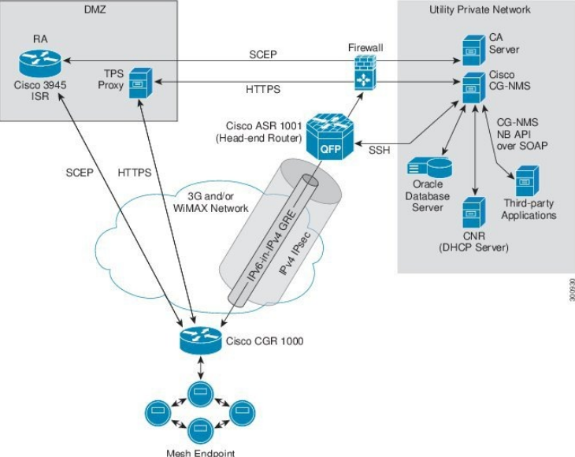

# Intro

(For the purposes of keeping this documentation finished within a timely mannaer, I'll be using some of [Cisco's own words](https://www.cisco.com/c/en/us/td/docs/routers/connectedgrid/iot_fnd/guide/5_0/b-iot-fnd-user-guide-50/m-overview-of-cisco-iot-field-network-director.html?bookSearch=true) while we are in production. Do not use this documentation as anything more than a guide. If it is wished for this documentation to be re-written in my own words, please ask. Anything within quotations is from Cisco's own words)

# Cisco's Field Network Device

"The Cisco IoT Field Network Director (IoT FND) is a network management system that manages multi-service network and security infrastructure for IoT applications, such as smart grid applications, including Advanced Metering Infrastructure (AMI), Distribution Automation (DA), distributed intelligence, and substation automation. IoT FND is a scalable, highly-secure, modular, and open platform with an extensible architecture. IoT FND is a multi-vendor, multi-service, communications network management platform that enables network connectivity to an open ecosystem of power grid devices.

IoT FND is built on a layered system architecture to enable clear separation between network management functionality and applications, such as a distribution management system (DMS), outage management system (OMS), and meter data management (MDM). This clear separation between network management and applications helps utilities roll out Smart Grid projects incrementally, for example with AMI, and extend into distribution automation using a shared, multi-service network infrastructure and a common, network management system across various utility operations."

## Features

- "Geographic Information System (GIS) map-based, visualization, monitoring, troubleshooting, and alarm notifications"
- "Group-based configuration management for routers and smart meter endpoints"
- "OS compatible (Cisco IOS, Guest OS, IOx) and provides application management"
- "Rule-engine infrastructure for customizable threshold-based alarm processing and event generation (only works for Cisco approved devices at this current moment"
- "North Bound API for transparent integration with utility head-end and operational systems"
- "High availability and disaster recovery"

# Architecture

Cisco's FND has a straightforward way of doing it's architecture. A more detailed explanation is within the documentation under ["IoT FND architecture"](https://www.cisco.com/c/en/us/td/docs/routers/connectedgrid/iot_fnd/guide/5_0/b-iot-fnd-user-guide-50/m-overview-of-cisco-iot-field-network-director.html?bookSearch=true)

## Endpoints and the Field Area Router

The below information is defined to help you have context as you read throughout the documentation. Please keep in mind the definitions for the architecture so your understanding of the operations available within this technology can be accurate.

### Field Area Router (FAR)

The field area router is a router that routes data collected from numerous endpoint devices. It routes this data to a central network (within this case, it routes it to the HER that it is connected to). 

### Mesh endpoints

The mesh endpoint devices can range drastically. There are many Cisco devices, third-party devices, and more that can count as an endpoint devices. The list of allowed devices are listed within the documentation for Cisco's FND.

## DMZ

The DMZ is a zone that you can send your data from the FARs during a production environment to add an extra layer of security to the data which you send. It has two parts.

### RA
The RA (Registration authority) ensures that direct communication between external devices (like FARs) and the internal CA server is avoided, enhancing the security posture of the network.

When a FAR is deployed and powered on, it initiates a certificate request using the Simple Certificate Enrollment Protocol (SCEP). The RA, residing in the DMZ, receives this request and forwards it to the internal CA server.​

Once the CA issues the certificate, the RA relays it back to the FAR. From here on, there is secure communcitaion within the network. Next is interaction with the TPS

### Tunnel Provisioning Server (TPS)

The TPS servesr as the final proxy between the FAR and the FND server. You can do a *swath* of configuration when it comes to the tunnel you are creating. 

When the FAR makes a request to the TPS, it will forward this request to the IoT FND application server. The security that allows for the request to pass is based on whether or not the FAR has recieved proper certification through the RA after it has requested this certification through the CA server. There is a way to do certification without having to request from the CA server through a PKI (public key infrastructure certificate). This certificate has its own template you can generate and then apply to your FAR and any related devices within the Tunnel, which would allow you to not need a CA server to grant certificates to allow for secure messaging.

## Head-end router, Firewall, and CA Server

### Head-end router

The head-end router is the central aggrigation point for the network. To give you an idea of how central, within a high-availability architecture (that is, one where you balance out your network through a load-balancer), you can have around 500 different FARs for one HER. The point of the HER is to aggregate traffic and forward it to the FND server (or to a load-balancer that then sends the traffic to one of many different FND servers).

The HER acts as a gateway bridge between the FND, the FARs, and the endpoint mesh devices. It ensures the data flow is as efficient as possible.

### Firewall

The firewall regulates traffic between the HERs, the DMZ, and the Tunnel provisioning Server (TPS). It makes sure that only authorized communication with the FND occurs.

### CA Server

The CA server issues digital certificates to network devices, including FARs and HERs. These certificates are fundamental for mutual authentication, ensuring that devices can securely identify and communicate with each other and with the IoT FND server. 

It issues, renews, and revokes certifications given to the FARs and the HERs within our deployment.

## IoT FND server

The IoT FND server hosts the main aspects of the FND a table detailing the aspects of the IoT FND server is within the documentaiton under ["Main components of IoT Solution"](https://www.cisco.com/c/en/us/td/docs/routers/connectedgrid/iot_fnd/guide/5_0/b-iot-fnd-user-guide-50/m-overview-of-cisco-iot-field-network-director.html?bookSearch=true). I will add available details under this section:

### IoT FND application server
    
This is the heart of IoT FND deployments. It runs on an RHEL server and allows administrators to control different aspects of the IoT FND deployment using its browser-based graphical user interface.

IoT FND HA deployments include two or more IoT FND servers that are connected to a load balancer.

### NMS Database

"This Oracle database stores all information that is managed by your IoT FND solution, including all metrics received from the MEs and all device properties such as firmware images, configuration templates, logs, event information, and so on."

### CPNR (DHCP Server)

Providing automated IP address assignment and management for both IPv4 and IPv6 network. Makes it easier to streamline network operations

### Third-party applications (North Bound API)

Within the documentation they are referencing many different types of applications. Mainly, applications that are used within the Management and monitoring of the Field area network and the FND. These applications will then interact with the FND through the NorthBound API. The NorthBound API works directly with the NMS database. It can retrieve data from the FND and help upload configurations and new devices through SOAP XML messages.
